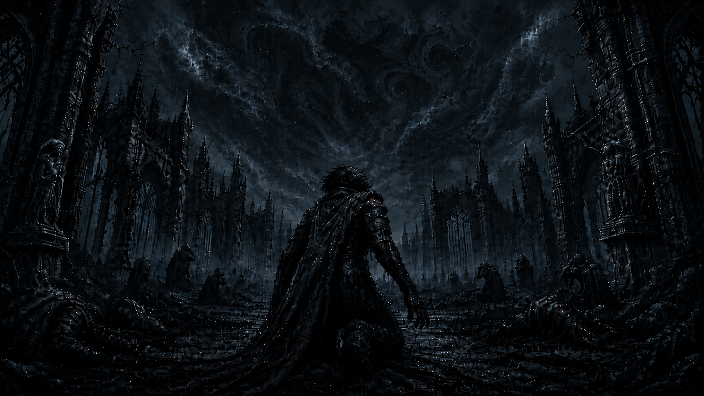

# Beyond the Veil of Sleep



A terminal-based dark fantasy RPG written in Python.

Beyond the Veil of Sleep is a personal project focused on learning programming through the development of a complete terminal RPG.

The game is being built step by step, with systems for character creation, exploration, combat, inventory, world events, and eventually AI-powered dynamic narration.

## About the Game

You awaken surrounded by corpses, blood, and memories that no longer belong to you.

With no certainty of who you are or what happened before your awakening, you must explore a hostile world while slowly uncovering the truth behind yourself and the horrors beyond the veil.

The project takes inspiration from dark fantasy, cosmic horror, and classic role-playing games.

## Current Features

* Terminal-based interface
* Main menu
* Invalid input handling
* Character creation
* Character attributes
* Default character name when memories fail
* Basic project modularization

## Planned Features

* Weapon system
* Enemies
* Turn-based combat
* Inventory
* Exploration
* Locations and world map
* Random events
* NPCs
* Quests
* Save and load system
* Dynamic story events
* AI-powered narration
* Context and memory system for the narrator

## AI Narration

One of the long-term goals of the project is to integrate an AI narrator.

The game engine will remain responsible for gameplay logic such as:

* Player health
* Damage
* Combat results
* Inventory
* Items
* Enemies
* World state

The AI will receive information about what happened and transform those events into dynamic narrative descriptions.

This keeps gameplay deterministic while allowing the story to be narrated differently during each playthrough.

## Project Structure

```text
beyond-the-veil-of-sleep/
├── main.py
├── initial_screen.py
├── player.py
├── assets/
│   └── banner.png
└── README.md
```

The project structure will evolve as new systems are implemented.

## Running the Project

Clone the repository:

```bash
git clone <repository-url>
```

Enter the project directory:

```bash
cd beyond-the-veil-of-sleep
```

Run:

```bash
python main.py
```

## Requirements

Currently:

* Python 3
* Windows

The project currently uses `msvcrt` for keyboard input, so some parts are Windows-specific.

Cross-platform support is planned for a future version.

## Development Status

🚧 **Work in Progress**

The project is being developed incrementally as a programming learning project.

Current stage:

**Character creation system**

## Goals

Beyond the Veil of Sleep is not only intended to become a playable RPG.

The project is also being used to practice:

* Python
* Object-oriented programming
* Project organization
* Git and GitHub
* Game logic
* Data structures
* File handling
* JSON
* APIs
* HTTP requests
* AI integration

## License

This project is currently developed for educational and personal purposes.
